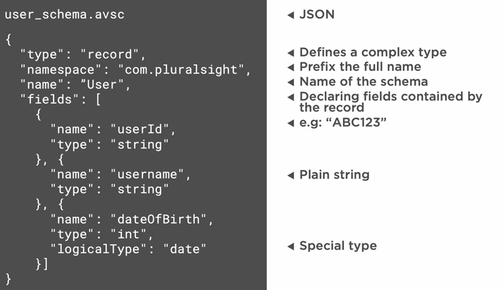
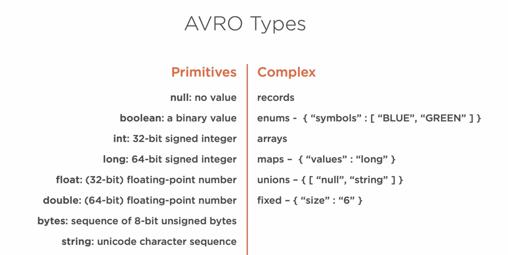

### AVRO Schema

Avro uses JSON-based schemas to define data structures. These schemas are either embedded within the container files, or they can be transferred as separate objects.\
Let's see how the serialization and deserialization processes work with Avro. We start off with our user data to which we have an Avro schema that corresponds to the data structure that the user object has incorporated.\
Next, we pass both the user data and the Avro schema to the Avro serializer. This serializer based on the schema provided will transform the user data in bytes. Those bytes can be transferred across a network or stored on a hard drive.\
When we want to get our user data back, we need to use a deserializer. The bytes are passed on the deserializer among the user schema. Without it, the deserializer will not be able to transform those bytes back into the user data. _Also, the correct schema needs to be passed. Otherwise, even with a slightly changed schema, the deserialization will fail._\
After the deserialization, the user object can now be used for further processing.

The file extension for Avro schemas is AVSC, but the content of it is JSON formatted.




Once we have the schema, we can use it to generate classes in different programming languages.\
For example, in Java, we can use the Avro Maven plugin to generate classes from the schema.\

To compile and generate Java classes from an Avro schema (.avsc) using Maven, follow these steps:\

#### Add Avro Plugin to pom.xml

Modify your pom.xml to include the Avro Maven plugin:

```xml
<build>
    <plugins>
        <plugin>
            <groupId>org.apache.avro</groupId>
            <artifactId>avro-maven-plugin</artifactId>
            <version>1.11.3</version> <!-- Use latest version -->
            <executions>
                <execution>
                    <phase>generate-sources</phase>
                    <goals>
                        <goal>schema</goal>
                    </goals>
                </execution>
            </executions>
            <configuration>
                <sourceDirectory>${project.basedir}/src/main/avro</sourceDirectory>
                <outputDirectory>${project.basedir}/target/generated-sources/avro</outputDirectory>
            </configuration>
        </plugin>
    </plugins>
</build>

<dependencies>
    <dependency>
        <groupId>org.apache.avro</groupId>
        <artifactId>avro</artifactId>
        <version>1.11.3</version>
    </dependency>
</dependencies>
```
#### Place the Avro Schema File (.avsc)

Save your Avro schema file inside:
```
src/main/avro/schema.avsc
```

#### Run Maven Command to Generate Java Classes
```shell
mvn clean compile
```
This will generate Java classes in:

```
target/generated-sources/avro/com/example/User.java
```

### Avro tools

Or we can use the Avro tools jar to generate classes from the schema.\

Download the avro-tools jar from the following link:\
```shell
wget https://repo1.maven.org/maven2/org/apache/avro/avro-tools/1.10.2/avro-tools-1.10.2.jar
```

To generate classes from the schema, use the following command:\
```
java -jar avro-tools-1.10.2.jar compile schema ../event-driven-using-kafka/schemas/user_schema.avsc ../event-driven-using-kafka/
```


