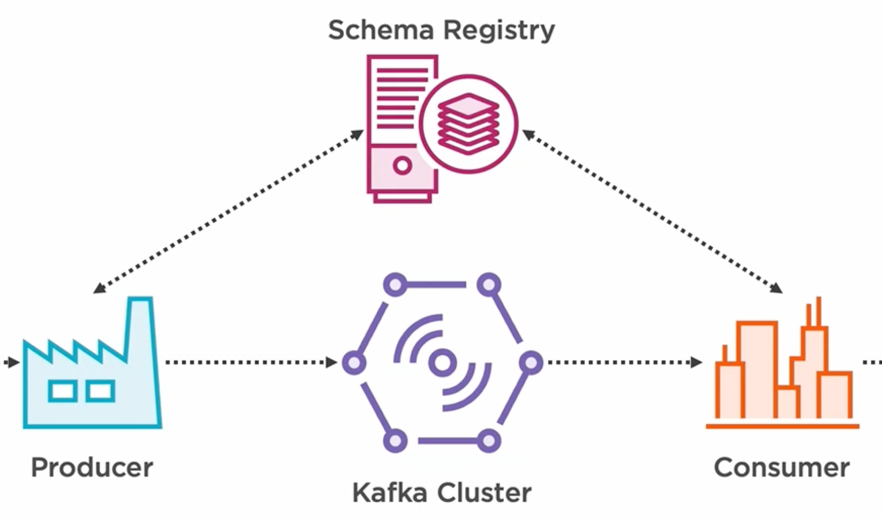

### Schema Registry

The Schema Registry is an application that handles the distribution of schemas to producers and consumers and storing them for long-term availability.



_The Schema Registry has an interesting solution for persisting the schema by using a Kafka topic to achieve that._

#### Subject name strategy

We know that all the schemas are stored in a Kafka topic, but in order to retrieve the exact schema that we need, a proper mechanism needs to be put in place.

Subject name strategy is achieving that by categorizing the schemas based on the topic that they belong to. The subject name will be the topic that we want schemas for, -key or -value.

The serializer at producer will ask the Schema Registry for the schema of the topic that it is producing to, and the deserializer at consumer will ask for the schema of the topic that it is consuming from.

In a non-production environment, the first application that interacts with the new topic can register the schema, but in a production environment, an administrator will have to upload them. 

The problem is that the Schema Registry stores the schemas in memory, and if something goes wrong, they are lost. The solution for this issue, Schema Registry is using an inbuilt producer, which transfers the schema in a special topic in the Kafka cluster. Now if the Schema Registry crashes, we can create a new instance which connects to the same Kafka cluster, and the inbuilt consumer can retrieve all the schemas stored in Kafka.

There are a few implementations of this Schema Registry, but in this demo, I'm going to use the one created by a company called Confluent because it is offering the best support for our schemas.


```shell
git clone https://github.com/confluentinc/schema-registry.git
```
We need checkout the available tag.

```shell
git checkout v5.2.0
```

Then, we will package the Schema Registry.

```shell
mvn clean package
```

After the packaging is done, we can start the Schema Registry.

```shell
./bin/schema-registry-start config/schema-registry.properties
```

The Schema Registry should now be running on port 8081.

